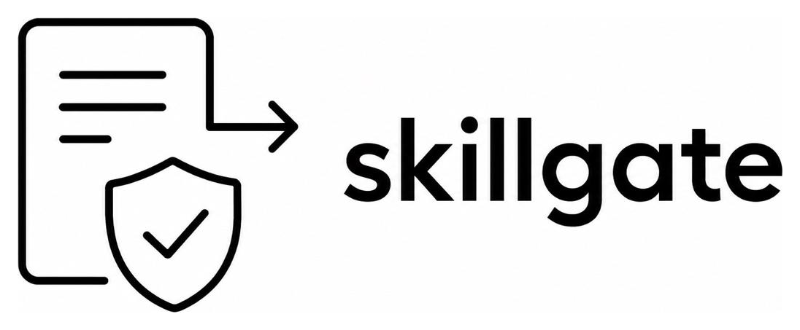
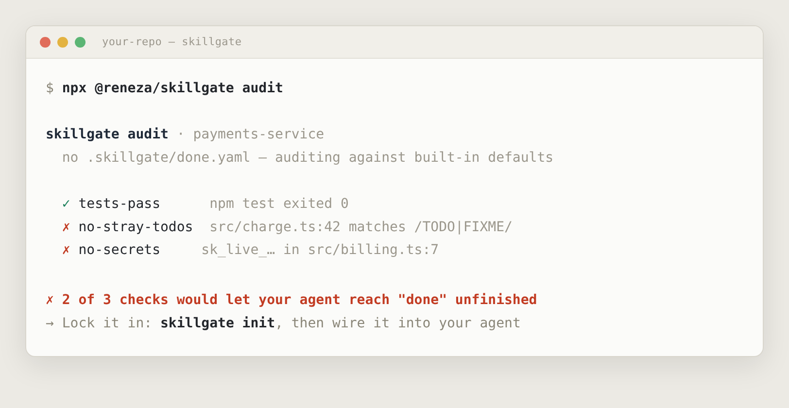

<p align="center">
  
</p>

# skillgate

<p align="center">
  <a href="https://github.com/renezander030/skillgate/actions/workflows/ci.yml"></a>
  <a href="https://www.npmjs.com/package/@reneza/skillgate"></a>
  <a href="LICENSE"></a>
  
</p>

> **A finish-line gate your agent cannot talk its way past.** AI coding agents deviate from your process to reach "done" faster, and asking the model to check its own compliance is the deviating party grading its own paper. `skillgate` is a deterministic evaluator that lives outside the model: it blocks the commit / push / publish until your definition-of-done actually passes. Works with **opencode** (any model you plug in), Claude Code, pre-commit, and CI.


## Audit your repo in one command

No install, no signup, no config. One read-only command shows which corners your agent could cut right now:

```bash
npx @reneza/skillgate@latest audit
```



Wired into your agent, those same checks deny the finish-line command (commit / push / publish) until they pass. [Wire it in.](#install)

## This is a measured, structural failure, not a vibe

In [*The Compliance Gap*](https://arxiv.org/html/2605.01771v1) (Shin, 2026 — 2,031 sessions, six frontier models), models verbally agree to a process instruction and then bypass it at a **0% compliance rate** under default conditions. Two results from that paper are the entire design basis for skillgate:

- **You cannot catch it by reading the output.** The gap is provably undetectable from text alone, by any human or LLM observer (Theorem 2, via the Data Processing Inequality). A model grading its own compliance is structurally blind to its own deviation. The evaluator has to observe behavior deterministically, out of band. That is what skillgate is.
- **Removing the shortcut is what works.** Taking away the affordance that lets the model cut the corner raised compliance from 0% to 75% (Cohen's *d* = 2.47), the strongest intervention measured. skillgate removes the affordance the only way that holds: it denies the finish-line command until the work is real.

Prompt-level fixes ("always follow the process") do not close the gap, because the cause is the reward structure, not the wording. A bigger model does not either: the paper shows the gap is environmentally afforded, not weight-encoded.

## No model in the loop


The check is a **pure function over the filesystem**: same inputs, same verdict, in milliseconds, with no model in the loop. That is the whole point. An LLM asked "is this done?" answers differently depending on the weather and has an incentive to say yes. A script does not. Because the judge is model-independent, it works the same whatever model you have plugged into your agent.

## Gate, not loop

A retry loop (the "Ralph" pattern: re-run the agent until it declares itself finished) is a *retry engine*. The question it cannot answer on its own is "done according to whom?" Left alone, the loop's stop condition is the model's own claim that it finished, which is exactly the signal the Compliance Gap shows you cannot trust: the agent says done, the loop exits, the deviation ships.

skillgate is the other half. It does not run the agent and it does not retry. It is the deterministic judge of whether the work is actually done. The two compose:

- **Loop, no gate** — retries until the *model* says stop. Fast, but it inherits the model's blind spot.
- **Gate, no loop** — blocks the finish line until the work is real, but will not drive the fix itself.
- **Loop + gate** — the loop keeps going because a script, not the model, decides each round is not done yet. The gate becomes the loop's stop condition.

Use a loop to make progress. Use skillgate to define when progress is allowed to end.

## Install

Pick the path that matches how far you want the guarantee to reach. Every one enforces the *same* `.skillgate/done.yaml`, so you define "done" once.

**1. Zero install — just run it**

```bash
npx @reneza/skillgate@latest check     # nothing to install; ideal for a first look
```

**2. Add it to a project** (CI, pre-commit, Claude Code, husky)

```bash
npm i -D @reneza/skillgate             # the CLI is then simply `skillgate check`
```

**3. No Node on the machine?** Run it in a container against the current directory — copy, paste, done:

```bash
docker run --rm -v "$PWD":/repo -w /repo node:20-alpine npx -y @reneza/skillgate check
```

**4. One server-side gate your agent can't bypass (a VPS).** The only *hard* layer that's free and works on private repos: the definition of done lives on a separate box the agent can never log into, and `git push --no-verify` cannot skip a server hook. One run provisions a fresh Debian/Ubuntu/Fedora/Alpine instance (the installer detects the package manager):

```bash
git clone https://github.com/renezander030/skillgate && cd skillgate/contrib/self-hosted-gate
ssh-keygen -t ed25519 -N "" -f ./push_key && cp ./push_key.pub ./authorized_key.pub
sh vps/setup.sh root@your-vps.example.com      # installs the gate, then prints how to push
```

Full walkthrough — mirror-to-GitHub, deploy keys, and the Docker / VM substrates — in [`contrib/self-hosted-gate`](contrib/self-hosted-gate/).

> **Render, Railway, Heroku-style PaaS?** Not applicable, and worth saying why: skillgate is a gate on `git push`, not a hosted service. A PaaS builds *after* the code already reached GitHub, so it adds no boundary the agent has to cross. For a server-side guarantee, use the VPS path above, or CI + branch protection (public repos and paid GitHub plans).

## Define your gates

A gate is one deterministic, machine-checkable condition. Run `npx @reneza/skillgate init` to drop a starter `.skillgate/done.yaml` that includes drift detection and an evidence-gate example right out of the box, then run `skillgate scaffold` to generate the evidence file templates the agent must fill in:

```bash
npx @reneza/skillgate init                               # create .skillgate/done.yaml
npx @reneza/skillgate scaffold                           # create .skillgate/evidence/
npx @reneza/skillgate scaffold --template react          # stack-specific evidence files
npx @reneza/skillgate scaffold --update-agents           # also update AGENTS.md/CLAUDE.md
```

The starter `done.yaml`:

```yaml
# skillgate — definition of done
# Docs: https://github.com/renezander030/skillgate
name: definition-of-done

# Commands that count as crossing the finish line (substring match).
finishLine:
  - "git commit"
  - "git push"
  - "npm publish"

gates:
  - id: instruction-sync
    description: AI agent instruction files are in sync
    type: instruction-sync

  - id: tests-pass
    description: Test suite passes
    type: command            # must exit 0
    run: "npm test --silent"

  - id: no-stray-todos
    description: No TODO or FIXME comment left in source
    type: absent             # regex must NOT appear in any matched file
    glob: "src/**/*.{ts,js}"
    pattern: '(//|#)\s*(TODO|FIXME)'

  - id: no-secrets
    description: No obvious secrets committed
    type: absent
    glob: "**/*.{ts,js,json,md,yaml,yml,env}"
    pattern: 'ghp_[A-Za-z0-9]{36}|sk_live_[A-Za-z0-9]{16,}|-----BEGIN (RSA |EC |OPENSSH )?PRIVATE KEY-----'
    ignore: [".skillgate/**"]
```

A `file-contains` gate (e.g. require a touched changelog) and the other types are in the table below; [`examples/`](examples/) has fuller specs.

### Gate types

| Type | Passes when |
|---|---|
| `file-exists` | every `file` path exists (`file` may be a list) |
| `file-contains` | `file` matches `pattern` (optional `flags`, e.g. `i`) |
| `absent` | `pattern` appears in **no** file matched by `glob` (reports `file:line`) |
| `command` | `run` exits 0 — only as deterministic as the command |
| `evidence` | a named `file` exists and is non-empty |
| `not-empty` | a directory at `path` contains at least `min` entries (default 1) |
| `instruction-sync` | every AI agent instruction file (CLAUDE.md, AGENTS.md, Cursor, Copilot…) still agrees with the canonical one (optional `threshold`, default 0.95) |

**The `evidence` escape hatch.** Gates only see machine-observable output. For a step like "research the API first," have the agent write `.skillgate/evidence/research.md` as it works and gate on that file. Otherwise the step is invisible and the deviation hides.

**Scaffold the evidence workflow.** Run `skillgate scaffold` to generate the evidence files for your stack — test-output.txt, lint-report.txt, diff-review.md, and a README explaining the workflow to the agent. Add `--update-agents` to write agent instructions directly into AGENTS.md / CLAUDE.md. Stack templates: `generic`, `ts-lib`, `react`, `python`.

```bash
skillgate scaffold                    # create evidence files for current stack
skillgate scaffold --template react   # React-specific evidence files
skillgate scaffold --update-agents    # also update AGENTS.md/CLAUDE.md
```

## Keep your agents reading the same rulebook

Every AI coding tool reads a different instruction file — `CLAUDE.md`, `AGENTS.md`, `.cursor/rules`, `.github/copilot-instructions.md`, `GEMINI.md`, `.clinerules`, `.windsurf/rules`, `.junie/guidelines.md` — and nothing keeps them in sync, so they quietly drift apart until each agent follows a different process. The `instruction-sync` gate fails the finish line when that happens. Four commands back it:

```bash
npx @reneza/skillgate drift                 # report drift, exit 1 if any file diverged
npx @reneza/skillgate drift --json          # machine-readable, for scripts and agents
npx @reneza/skillgate diff-instructions     # show line-level diff of what actually changed
npx @reneza/skillgate canonical <file>      # pin which file is the single source of truth
npx @reneza/skillgate sync                  # make AGENTS.md canonical, link the rest
npx @reneza/skillgate sync --dry-run        # preview without writing
npx @reneza/skillgate sync --symlink        # use symlinks instead of pointer files/copies
```

```
canonical: AGENTS.md

  ✓ AGENTS.md        canonical  100%  AGENTS.md
  ✓ Claude Code      linked     100%  CLAUDE.md
  ✗ GitHub Copilot   drifted     25%  .github/copilot-instructions.md

✗ 1 of 3 instruction files drifted — run `skillgate sync`
```

`sync` understands harness semantics, not just bytes: import-capable tools (Claude Code, Gemini) get a one-line `@AGENTS.md` pointer, the rest get a synced copy, `@AGENTS.md` imports and symlinks already count as linked, and Cursor's `.mdc` frontmatter is per-tool config that's ignored in comparison. The canonical source is `AGENTS.md` when present, otherwise the freshest file. (This capability was the standalone `adrift` tool, now folded in.)

## Wire it into your agent

### opencode

opencode has no blocking session-end hook, so enforcement lives where it can actually stop the agent: `tool.execute.before`. The plugin denies finish-line commands until the gates pass. Add it to your config:

```jsonc
// opencode.json
{
  "$schema": "https://opencode.ai/config.json",
  "plugin": ["@reneza/skillgate"]
}
```

That is the whole integration. Whatever model you have configured, the gate is the same.

### Claude Code

A `PreToolUse` deny on finish-line commands, calling the CLI:

```jsonc
// .claude/settings.json
{
  "hooks": {
    "PreToolUse": [
      {
        "matcher": "Bash",
        "hooks": [{ "type": "command", "command": "npx @reneza/skillgate check --json >/dev/null || exit 2" }]
      }
    ]
  }
}
```

### pre-commit and CI — works for any agent or model

These need no harness integration at all, which makes them the universal backstop. See [`contrib/`](contrib/) for a ready [pre-commit hook](contrib/pre-commit-config.yaml) and [GitHub Action](contrib/github-action.yml). Pair the Action with branch protection and a required status check: that layer lives server-side, outside any agent's reach.

> **Private repo, Free account?** GitHub doesn't enforce branch protection on private repos under a Free personal plan — so the only *hard* layer above is unavailable. Get the same guarantee for free by running the evaluator somewhere the agent can't reach: a self-hosted server-side `pre-receive` gate on a [VM, a Docker container, or a small remote VPS](contrib/self-hosted-gate/). `git push --no-verify` can't skip a server hook, and the definition of done lives on a box the agent can't log into. Pick the substrate by how well your agent is already sandboxed — see [`contrib/self-hosted-gate`](contrib/self-hosted-gate/).

### Not a husky replacement — what husky runs

husky, lefthook, and pre-commit are **hook runners**: they wire a command to a git event. They don't know what "done" means; you tell them what to run. skillgate is the thing they run. If you already use husky, point its `pre-commit` at skillgate:

```bash
# .husky/pre-commit
npx @reneza/skillgate check
```

Two differences that matter beyond "git hook vs git plumbing":

- **skillgate also guards the agent layer.** husky only sees git, so it can only act once the agent reaches a commit. The opencode / Claude Code adapters deny the finish-line command *before* git is even involved, with the unmet gates fed back into the same session.
- **A git hook is bypassable** (`--no-verify`) and only as strong as the policy inside it. skillgate is that policy as data (`.skillgate/done.yaml`), reusable verbatim across husky, pre-commit, CI, and the agent hooks. Define done once, enforce it everywhere.

## The honest part: layers are not equal

| Layer | Strength |
|---|---|
| opencode / Claude Code deny | **Soft** — enforced locally; a locked-down harness permission profile makes it hold |
| pre-commit | **Soft** — bypassable with `--no-verify` |
| CI + branch protection | **Hard** — runs server-side, the agent has no write access to it |
| [self-hosted `pre-receive`](contrib/self-hosted-gate/) | **Hard** — server-side on a box the agent can't log into; free, and works on private repos with no paid tier |

Use the harness hooks for fast feedback in the loop; rely on CI for the guarantee.

## Documentation

- [Quickstart](docs/quickstart.md) — audit, define, check, wire in.
- [Spec reference](docs/spec-reference.md) — every gate type and option, plus the [JSON Schema](schema/done.schema.json) for editor autocomplete.
- [Recipes](docs/recipes.md) — Claude Code, pre-commit, CI, loop+gate, self-hosted server.
- [Architecture](docs/architecture.md) — how the modules fit and how to add a gate type.
- [Compatibility & deprecation policy](docs/compatibility.md) — SemVer, spec versioning, the exit-code contract.
- [Contributing](CONTRIBUTING.md) · [Security policy](SECURITY.md) · [Code of conduct](CODE_OF_CONDUCT.md)

## Related

Same conviction in every one of these — *the model suggests, a deterministic boundary it can't route around decides* — applied at a different layer of the stack:

- **[draftcat](https://github.com/renezander030/draftcat)** — the principle at the **business-operations** layer. A self-hosted Go pipeline engine where the LLM can't fire customer-facing actions (email, CRM, lead replies, voice) without passing deterministic checks and a human operator's sign-off. skillgate is the same idea at the **engineering** layer: it gates *shipping code* instead of *contacting customers*, and its judge is an automated check rather than a human approver (because "do the tests pass?" doesn't need a person).
- **[agent-approval-gate](https://github.com/renezander030/agent-approval-gate)** — the minimal *pattern* (schemas + examples) behind that approval step: gate an agent's real-world actions behind human approval and an audit log. skillgate decides *"is it done?"*; agent-approval-gate decides *"should this action fire, and who approved it?"*

> **adrift** (instruction-file drift detection) is now part of skillgate — see [`drift` and `sync`](#keep-your-agents-reading-the-same-rulebook) above.

## License

MIT © Rene Zander
