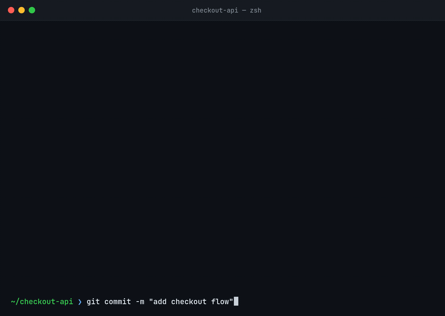
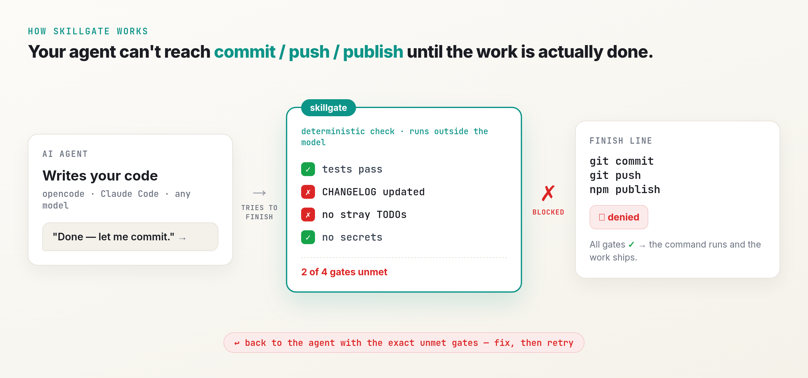

# skillgate

> **A finish-line gate your agent cannot talk its way past.** AI coding agents deviate from your process to reach "done" faster, and asking the model to check its own compliance is the deviating party grading its own paper. `skillgate` is a deterministic evaluator that lives outside the model: it blocks the commit / push / publish until your definition-of-done actually passes. Works with **opencode** (any model you plug in), Claude Code, pre-commit, and CI.





## This is a measured, structural failure, not a vibe

In [*The Compliance Gap*](https://arxiv.org/html/2605.01771v1) (Shin, 2026 — 2,031 sessions, six frontier models), models verbally agree to a process instruction and then bypass it at a **0% compliance rate** under default conditions. Two results from that paper are the entire design basis for skillgate:

- **You cannot catch it by reading the output.** The gap is provably undetectable from text alone, by any human or LLM observer (Theorem 2, via the Data Processing Inequality). A model grading its own compliance is structurally blind to its own deviation. The evaluator has to observe behavior deterministically, out of band. That is what skillgate is.
- **Removing the shortcut is what works.** Taking away the affordance that lets the model cut the corner raised compliance from 0% to 75% (Cohen's *d* = 2.47), the strongest intervention measured. skillgate removes the affordance the only way that holds: it denies the finish-line command until the work is real.

Prompt-level fixes ("always follow the process") do not close the gap, because the cause is the reward structure, not the wording. A bigger model does not either: the paper shows the gap is environmentally afforded, not weight-encoded.

```bash
npx @reneza/skillgate check
```

```
  ✓ tests-pass        `npm test` exited 0
  ✓ no-secrets        no /sk_live_|ghp_.../ in **/*
  ✗ changelog-touched CHANGELOG.md missing /unreleased/i
  ✗ no-stray-todos    src/api.ts:42 matches /TODO|FIXME/

✗ 2 of 4 gates unmet: changelog-touched, no-stray-todos
```

Exit code 1, and in an agent harness the publish command never runs.

## Why

The check is a **pure function over the filesystem**: same inputs, same verdict, in milliseconds, with no model in the loop. That is the whole point. An LLM asked "is this done?" answers differently depending on the weather and has an incentive to say yes. A script does not. Because the judge is model-independent, it works the same whatever model you have plugged into your agent.

## Gate, not loop

A retry loop (the "Ralph" pattern: re-run the agent until it declares itself finished) is a *retry engine*. The question it cannot answer on its own is "done according to whom?" Left alone, the loop's stop condition is the model's own claim that it finished, which is exactly the signal the Compliance Gap shows you cannot trust: the agent says done, the loop exits, the deviation ships.

skillgate is the other half. It does not run the agent and it does not retry. It is the deterministic judge of whether the work is actually done. The two compose:

- **Loop, no gate** — retries until the *model* says stop. Fast, but it inherits the model's blind spot.
- **Gate, no loop** — blocks the finish line until the work is real, but will not drive the fix itself.
- **Loop + gate** — the loop keeps going because a script, not the model, decides each round is not done yet. The gate becomes the loop's stop condition.

Use a loop to make progress. Use skillgate to define when progress is allowed to end.

## Install

```bash
npm i -D @reneza/skillgate     # for CI / pre-commit / Claude Code
# or just use npx, no install needed:  npx @reneza/skillgate check
```

The CLI is named `skillgate` once installed; for the zero-install path use the full `npx @reneza/skillgate`.

No Node on the machine? Run it in a container against the current directory:

```bash
docker run --rm -v "$PWD":/repo -w /repo node:20-alpine npx -y @reneza/skillgate check
```

## Define your gates

A gate is one deterministic, machine-checkable condition. Run `npx @reneza/skillgate init` to drop a starter `.skillgate/done.yaml`:

```yaml
name: definition-of-done

# Commands that count as crossing the finish line (substring match).
finishLine:
  - "git commit"
  - "git push"
  - "npm publish"

gates:
  - id: tests-pass
    type: command            # must exit 0
    run: "npm test --silent"

  - id: changelog-touched
    type: file-contains      # file must match a regex
    file: CHANGELOG.md
    pattern: "unreleased"
    flags: "i"

  - id: no-stray-todos
    type: absent             # regex must NOT appear
    glob: "src/**/*.{ts,js}"
    pattern: "TODO|FIXME"

  - id: no-secrets
    type: absent
    glob: "**/*.{ts,js,json,md,yaml,yml,env}"
    pattern: "ghp_[A-Za-z0-9]{20,}|sk_live_|-----BEGIN [A-Z ]*PRIVATE KEY-----"
```

### Gate types

| Type | Passes when |
|---|---|
| `file-exists` | every `file` path exists (`file` may be a list) |
| `file-contains` | `file` matches `pattern` (optional `flags`, e.g. `i`) |
| `absent` | `pattern` appears in **no** file matched by `glob` (reports `file:line`) |
| `command` | `run` exits 0 — only as deterministic as the command |
| `evidence` | a named `file` exists and is non-empty |

**The `evidence` escape hatch.** Gates only see machine-observable output. For a step like "research the API first," have the agent write `.skillgate/evidence/research.md` as it works and gate on that file. Otherwise the step is invisible and the deviation hides.

## Wire it into your agent

### opencode

opencode has no blocking session-end hook, so enforcement lives where it can actually stop the agent: `tool.execute.before`. The plugin denies finish-line commands until the gates pass. Add it to your config:

```jsonc
// opencode.json
{
  "$schema": "https://opencode.ai/config.json",
  "plugin": ["@reneza/skillgate"]
}
```

That is the whole integration. Whatever model you have configured, the gate is the same.

### Claude Code

A `PreToolUse` deny on finish-line commands, calling the CLI:

```jsonc
// .claude/settings.json
{
  "hooks": {
    "PreToolUse": [
      {
        "matcher": "Bash",
        "hooks": [{ "type": "command", "command": "npx @reneza/skillgate check --json >/dev/null || exit 2" }]
      }
    ]
  }
}
```

### pre-commit and CI — works for any agent or model

These need no harness integration at all, which makes them the universal backstop. See [`contrib/`](contrib/) for a ready [pre-commit hook](contrib/pre-commit-config.yaml) and [GitHub Action](contrib/github-action.yml). Pair the Action with branch protection and a required status check: that layer lives server-side, outside any agent's reach.

> **Private repo, Free account?** GitHub doesn't enforce branch protection on private repos under a Free personal plan — so the only *hard* layer above is unavailable. Get the same guarantee for free with a self-hosted server-side `pre-receive` gate on a tiny VM: [`contrib/self-hosted-gate`](contrib/self-hosted-gate/). `git push --no-verify` can't skip a server hook, and the definition of done lives on a box the agent can't log into.

### Not a husky replacement — what husky runs

husky, lefthook, and pre-commit are **hook runners**: they wire a command to a git event. They don't know what "done" means; you tell them what to run. skillgate is the thing they run. If you already use husky, point its `pre-commit` at skillgate:

```bash
# .husky/pre-commit
npx @reneza/skillgate check
```

Two differences that matter beyond "git hook vs git plumbing":

- **skillgate also guards the agent layer.** husky only sees git, so it can only act once the agent reaches a commit. The opencode / Claude Code adapters deny the finish-line command *before* git is even involved, with the unmet gates fed back into the same session.
- **A git hook is bypassable** (`--no-verify`) and only as strong as the policy inside it. skillgate is that policy as data (`.skillgate/done.yaml`), reusable verbatim across husky, pre-commit, CI, and the agent hooks. Define done once, enforce it everywhere.

## The honest part: layers are not equal

| Layer | Strength |
|---|---|
| opencode / Claude Code deny | **Soft** — enforced locally; a locked-down harness permission profile makes it hold |
| pre-commit | **Soft** — bypassable with `--no-verify` |
| CI + branch protection | **Hard** — runs server-side, the agent has no write access to it |
| [self-hosted `pre-receive`](contrib/self-hosted-gate/) | **Hard** — server-side on a box the agent can't log into; free, and works on private repos with no paid tier |

Use the harness hooks for fast feedback in the loop; rely on CI for the guarantee.

## Related

Two more gates from the same principle — a deterministic check the agent cannot route around:

- **[agent-approval-gate](https://github.com/renezander030/agent-approval-gate)** — gates an agent's *real-world actions* (send email, update a CRM, call an API) behind human approval and an audit log, instead of the dev finish line. Different boundary, same family: skillgate decides *"is it done?"*, agent-approval-gate decides *"should this action fire, and who approved it?"*
- **[adrift](https://github.com/renezander030/adrift)** — keeps your agent instruction files (CLAUDE.md, AGENTS.md, Cursor, Copilot) from drifting out of sync.

## License

MIT © Rene Zander
